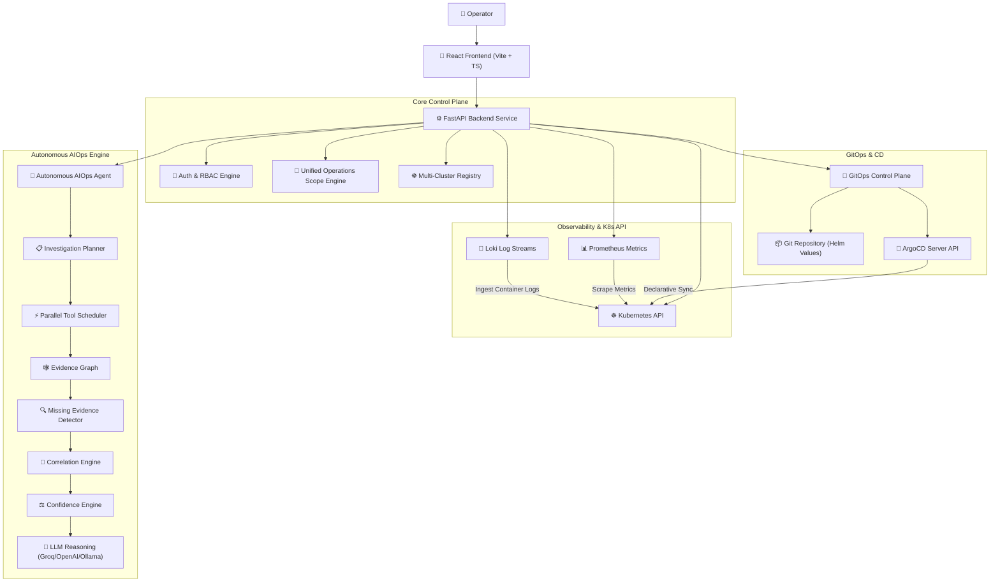

# DevOps Nexus — Enterprise Internal Developer Platform (IDP) & Autonomous AIOps Control Plane

[](LICENSE)
[](https://kubernetes.io/)
[](https://argoproj.github.io/cd/)
[](https://fastapi.tiangolo.com/)
[](https://reactjs.org/)

**DevOps Nexus** is an Enterprise-grade Internal Developer Platform (IDP), Autonomous AIOps Control Plane, and GitOps Management Engine. It bridges Kubernetes cluster operations, declarative continuous delivery (ArgoCD), multi-dimensional telemetry (Prometheus & Loki), fine-grained RBAC authorization, and autonomous AI-driven root cause diagnostics into a unified operational workspace.

---

## 🌟 Key Capabilities

* ☸️ **Multi-Cluster Kubernetes Operations**: Real-time management of pods, deployments, nodes, namespaces, ingress, and secrets across single and multi-cluster registries.
* 🐙 **Enterprise GitOps Control Plane**: 12-stage non-bypassable Git write-back scaling pipeline with automated Helm value modification, Git commit/push, and ArgoCD synchronization.
* 🧠 **Autonomous AIOps Engine**: SRE-inspired diagnostic engine featuring dynamic planning, parallel tool execution, missing evidence discovery, cross-telemetry correlation, and deterministic confidence scoring ($0\% - 100\%$).
* 📊 **Zero-Degraded Observability**: Real-time Prometheus metrics, Loki log streams, and K8s event aggregation backed by automatic port-forward daemons and K8s API fail-safe fallbacks.
* 🔐 **Enterprise Security & RBAC**: Role-based access control (`Administrator`, `Platform Engineer`, `DevOps Engineer`, `Developer`, `Viewer`) with password policy enforcement and PostgreSQL audit logging.

---

## 🏗️ System Architecture



---

## 📂 Project Structure

```text
├── architecture/                 # System, AI, GitOps, & Observability Architecture specs
├── docs/                         # Comprehensive platform guides & API references
├── platform/
│   ├── backend/                  # FastAPI Core Backend Service & AI Agent Runtime
│   │   ├── app/clients/          # Kubernetes, ArgoCD, Prometheus, Loki, GitHub clients
│   │   ├── app/routers/          # REST API Endpoints (K8s, GitOps, Telemetry, AI, Auth)
│   │   └── app/services/         # Business logic (AIOps pipeline, GitOps engine, Scope)
│   ├── frontend/                 # Vite React 18 TypeScript Dashboard UI
│   └── shared/                   # Shared exceptions & model definitions
├── helm/                         # Microservice Helm Charts (auth, payment, orders, etc.)
├── gitops/                       # ArgoCD application manifests
├── kubernetes/                   # Base Kubernetes manifest specifications
└── examples/                     # Sample requests, API payloads, & usage examples
```

---

## 🚀 Quick Start Guide

### Prerequisites
* Linux / macOS environment with `docker` and `docker-compose`
* Active `minikube` or Kubernetes cluster context
* Python 3.11+ & Node.js 18+

### 1. Launch Platform via Docker Compose
```bash
docker-compose up -d
```

### 2. Access Web Platform
* **Platform Dashboard**: [http://localhost:3000](http://localhost:3000)
* **Backend API Specs**: [http://localhost:8000/docs](http://localhost:8000/docs)
* **Default Credentials**: `admin` / `DevOpsNexus@123`

---

## 📚 Documentation Links

* 🏗️ [System Architecture](file:///home/satoru/Projects/Microservice-Deployment-Monitoring-Platform/architecture/system_architecture.md)
* 🧠 [Autonomous AI Engine Specs](file:///home/satoru/Projects/Microservice-Deployment-Monitoring-Platform/architecture/ai_architecture.md)
* 🔄 [GitOps Control Plane Specs](file:///home/satoru/Projects/Microservice-Deployment-Monitoring-Platform/architecture/gitops_architecture.md)
* 📊 [Observability & Telemetry Specs](file:///home/satoru/Projects/Microservice-Deployment-Monitoring-Platform/architecture/observability_architecture.md)
* 📖 [Full Documentation Catalog](file:///home/satoru/Projects/Microservice-Deployment-Monitoring-Platform/docs/01-prerequisites.md)

---

## 📄 License
This project is licensed under the MIT License — see the [LICENSE](LICENSE) file for details.
