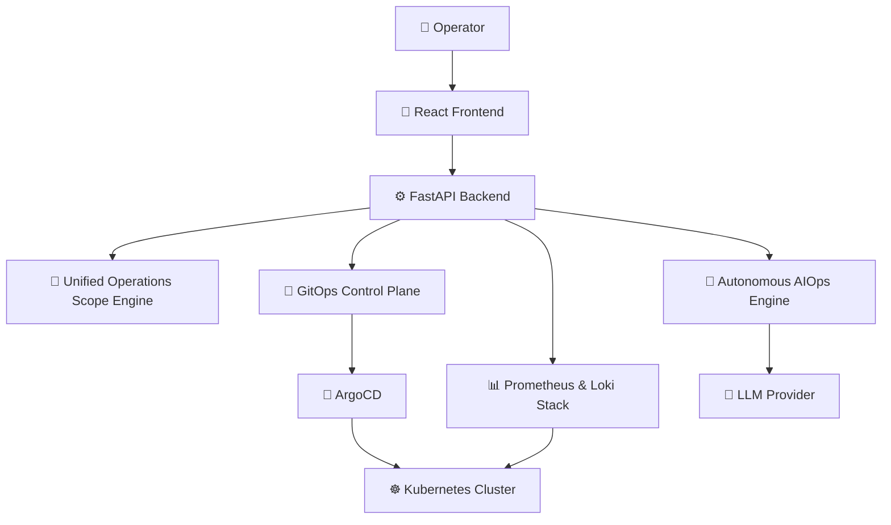

# DevOps Nexus — Enterprise Architecture Documentation

Welcome to the **DevOps Nexus Architecture Documentation**. This directory contains complete technical specifications for the DevOps Nexus Enterprise Internal Developer Platform (IDP), GitOps Control Plane, Observability Stack, and Autonomous AIOps Engine.

---

## 📚 Architecture Documentation Index

| Document | Description |
|---|---|
| 🏗️ [System Architecture](file:///home/satoru/Projects/Microservice-Deployment-Monitoring-Platform/architecture/system_architecture.md) | High-level system architecture, component interactions, and scope resolution specifications. |
| 🧠 [AIOps Investigation Engine](file:///home/satoru/Projects/Microservice-Deployment-Monitoring-Platform/architecture/ai_architecture.md) | Autonomous diagnostic engine architecture (`Planner`, `Scheduler`, `Evidence Graph`, `Correlation Engine`, `Confidence Engine`). |
| 🔄 [GitOps Control Plane](file:///home/satoru/Projects/Microservice-Deployment-Monitoring-Platform/architecture/gitops_architecture.md) | 12-stage Git write-back pipeline, Helm values management, and ArgoCD synchronization specs. |
| 📊 [Observability & Telemetry](file:///home/satoru/Projects/Microservice-Deployment-Monitoring-Platform/architecture/observability_architecture.md) | Prometheus metrics, Loki log streams, K8s event collectors, and zero-degraded fail-safe architecture. |

---

## 🏛️ System Overview

