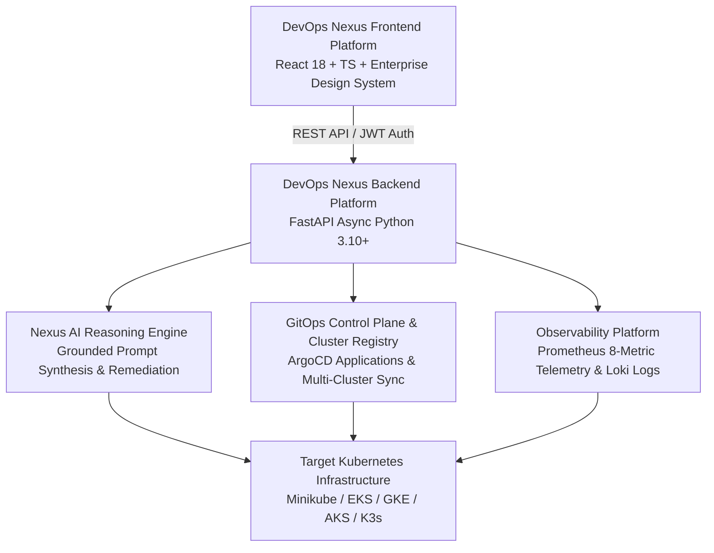

# 📐 DevOps Nexus v1.0 — Architecture Diagrams & Engineering Artifacts

This directory contains visual architecture diagrams, vector graphics (`.svg`), and editable Draw.io XML models (`.drawio`) for **DevOps Nexus v1.0**.

---

## 🎨 How to View Diagrams Visually

### Method 1: Interactive Draw.io Editor (Visual Canvas)
Open any `.drawio` file in this directory using the **Draw.io Integration** extension or [app.diagrams.net](https://app.diagrams.net):
- 📐 [`system-overview.drawio`](system-overview.drawio) — System Architecture Overview
- 📐 [`backend-architecture.drawio`](backend-architecture.drawio) — FastAPI Backend Architecture
- 📐 [`frontend-architecture.drawio`](frontend-architecture.drawio) — React 18 Frontend Architecture
- 📐 [`nexus-ai.drawio`](nexus-ai.drawio) — Nexus AI Reasoning Engine
- 📐 [`gitops-control-plane.drawio`](gitops-control-plane.drawio) — GitOps Control Plane
- 📐 [`cluster-registry.drawio`](cluster-registry.drawio) — Multi-Cluster Registry
- 📐 [`database-er.drawio`](database-er.drawio) — PostgreSQL Database Schema
- 📐 [`deployment-architecture.drawio`](deployment-architecture.drawio) — Container Deployment Topology

---

### Method 2: Vector SVG Images (Instant Image View)
Click any `.svg` image link below to open directly in your editor image viewer:
- 🖼️ [`system-overview.svg`](system-overview.svg)
- 🖼️ [`backend-architecture.svg`](backend-architecture.svg)
- 🖼️ [`frontend-architecture.svg`](frontend-architecture.svg)
- 🖼️ [`nexus-ai.svg`](nexus-ai.svg)
- 🖼️ [`gitops-control-plane.svg`](gitops-control-plane.svg)
- 🖼️ [`database-er.svg`](database-er.svg)

---

### Method 3: Markdown Preview Mode
Open [`docs/03-system-architecture.md`](../docs/03-system-architecture.md) and click the **Open Preview to the Side** button `[|]` at the top right of your editor window.

---

## 🏛️ System Architecture Overview

---

## ⚙️ Backend Platform Architecture

---

## 🎨 Frontend Platform Architecture

---

## 🧠 Nexus AI Reasoning Architecture

