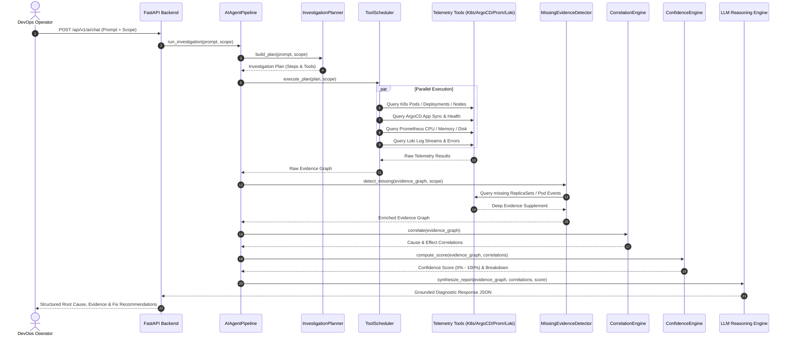

# Autonomous AIOps Investigation Engine Architecture

## Overview

The **Autonomous AIOps Investigation Engine** in DevOps Nexus replaces legacy chatbot architectures with a multi-phase SRE diagnostic pipeline. It behaves like an autonomous Site Reliability Engineer: it formulates hypothesis plans, executes parallel tool lookups, discovers missing evidence, correlates cross-telemetry signals, calculates deterministic confidence scores, and synthesizes grounded diagnostic root causes.

---

## 🔄 AIOps Investigation Execution Flow

---

## 🛠️ Stage Breakdown & Responsibilities

### 1. Intent Classification & `InvestigationPlanner`
* **Responsibility**: Analyzes the user prompt and scope context to classify intent into operational domains:
  * `ROOT_CAUSE`: Full incident diagnostic plan (Pods, Events, Logs, Metrics, ArgoCD).
  * `ARGOCD_ANALYSIS`: GitOps sync drift and deployment health plan.
  * `METRICS_REQUEST`: CPU, Memory, Disk, and Network telemetry plan.
  * `LOG_REQUEST`: Loki log stream parsing and error filter plan.
* **Output**: Ordered execution plan specifying required tool targets.

### 2. `ToolScheduler` (Parallel Tool Execution)
* **Responsibility**: Concurrently executes telemetry tool calls across system subsystems using thread pools with 3.0-second timeouts and automatic retry bounds.
* **Tools Called**:
  * `pods`: K8s pod status, restarts, exit codes, node assignments.
  * `deployments`: K8s deployment specs, desired vs ready replicas.
  * `nodes`: K8s node conditions, ready states, resource allocations.
  * `events`: K8s cluster warning/critical events.
  * `argocd`: ArgoCD application sync status, health, target revision.
  * `prometheus`: CPU, Memory, Disk, and Network metrics queries.
  * `loki`: Loki log streams for error patterns.

### 3. `MissingEvidenceDetector`
* **Responsibility**: Identifies gaps in initial evidence graph. If a pod is missing or in `CrashLoopBackOff`, automatically fetches parent ReplicaSet specs, container exit status codes (e.g. `Exit 137` OOMKilled), and previous container logs.

### 4. `CorrelationEngine`
* **Responsibility**: Applies deterministic cross-telemetry correlation rules:
  * **OOMKilled Rule**: Container Exit 137 + Prometheus Memory Utilization > 90% ➔ Root Cause: Memory Limit Exceeded.
  * **GitOps Drift Rule**: ArgoCD Sync Status "OutOfSync" + Replica Count mismatch ➔ Root Cause: Uncommitted Git state or manual cluster edit.
  * **Node Pressure Rule**: Node Condition "MemoryPressure" + Pod Pending ➔ Root Cause: Node resource exhaustion.

### 5. `ConfidenceEngine`
* **Responsibility**: Computes mathematical confidence scores ($0\%$ to $100\%$) based on:
  * Evidence completeness ratio.
  * Tool execution success rate.
  * Telemetry fallback penalization.
  * Strength of cross-dimensional correlations.

### 6. `ReasoningEngine` & LLM Narration
* **Responsibility**: Formulates the final diagnostic report grounded strictly in the Evidence Graph. Ensures zero hallucination by enforcing that all reported facts reference empirical evidence lines.
