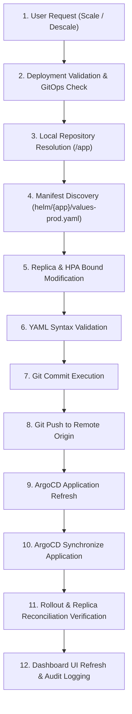

# Enterprise GitOps Control Plane Architecture

## Overview

The **GitOps Control Plane** in DevOps Nexus enforces a strict, auditable, declarative infrastructure model. Direct imperative modifications (such as calling `kubectl scale` directly on GitOps-managed workloads) are prohibited. All scaling, configuration, and image updates must flow through verified Git write-backs and ArgoCD synchronization.

---

## 🔄 12-Stage GitOps Write-Back Pipeline

---

## 📑 Pipeline Stage Details

| Stage | Component | Action & Responsibilities |
|---|---|---|
| **1. User Request** | Frontend (`Deployments.tsx`) | Captures user scale/descale input and sends POST request to `/api/v1/k8s/deployments/{ns}/{name}/scale`. |
| **2. Deployment Validation** | `DeploymentService` | Resolves deployment K8s name, checks if target is managed by ArgoCD (`is_gitops`). |
| **3. Repository Resolution** | `GitOpsControlPlane` | Resolves absolute Git repository working directory (`base_dir`). |
| **4. Manifest Discovery** | `GitOpsControlPlane` | Locates target Helm values files (`values-prod.yaml`, `values.yaml`) associated with the ArgoCD application. |
| **5. Replica Modification** | `GitOpsControlPlane` | Performs regex modifications on `replicaCount`, `hpa.minReplicas`, and `hpa.maxReplicas`. |
| **6. YAML Validation** | `GitOpsControlPlane` | Ensures modified Helm values files maintain valid YAML formatting. |
| **7. Git Commit** | `subprocess / git` | Configures git committer identity and runs `git commit -m "scale(gitops): scale {app} to {N} replicas"`. |
| **8. Git Push** | `subprocess / git` | Executes `git push` to push updated manifests to remote GitHub origin repository. |
| **9. ArgoCD Refresh** | `ArgoCDClient` | Calls `/api/v1/applications/{name}?refresh=hard` to invalidate ArgoCD revision cache. |
| **10. ArgoCD Sync** | `ArgoCDClient` | Calls `/api/v1/applications/{name}/sync` to trigger declarative cluster reconciliation. |
| **11. Rollout Verification** | `DeploymentService` | Polls K8s deployment spec until `ready_replicas == desired_replicas`. |
| **12. Dashboard Refresh** | Frontend (`api.ts`) | Re-fetches deployment inventory and renders updated status and replica counts. |

---

## 🔒 Security & RBAC Enforcement

* **Role Verification**: Only operators with `Administrator`, `Platform Engineer`, or `DevOps Engineer` roles can execute scaling operations.
* **Audit Trail**: Every GitOps operation writes an audit log entry in PostgreSQL containing `username`, `role_name`, `action`, `target_resource`, and `new_value`.
* **Zero-Bypass Policy**: Bypassing Git to patch K8s deployments directly is blocked for all GitOps-tracked workloads.
