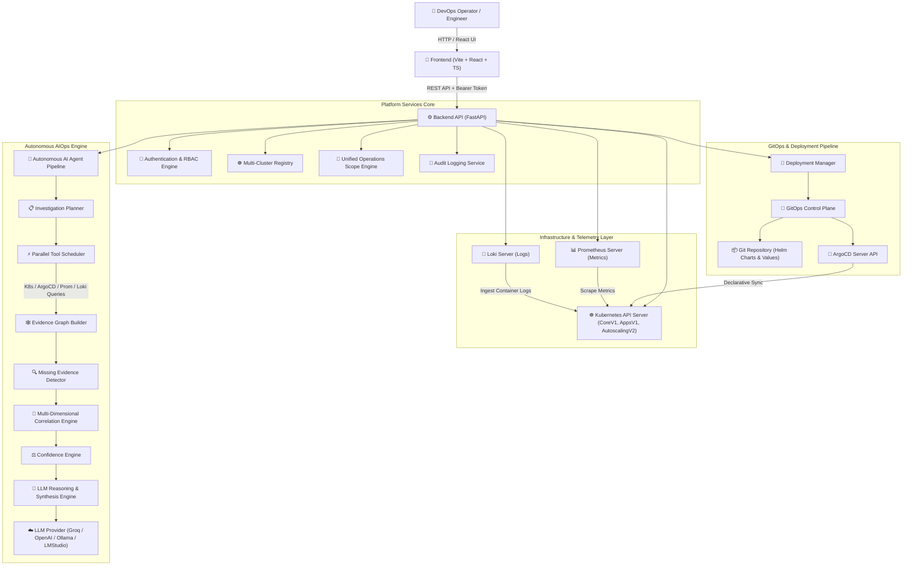

# DevOps Nexus — Enterprise System Architecture Specification

## Overview

**DevOps Nexus** is an Enterprise Internal Developer Platform (IDP), Autonomous AIOps Control Plane, and GitOps Management Engine. It bridges Kubernetes cluster operations, continuous delivery (ArgoCD), multi-dimensional telemetry (Prometheus & Loki), and autonomous AI-driven root cause diagnostics into a unified operational workspace.

---

## 🏗️ High-Level System Architecture

---

## 🧩 Subsystem Specifications

### 1. Unified Operations Scope Engine
* **Purpose**: Enforces context-aware operational boundaries across single or multi-cluster environments.
* **Modes**:
  * `CLUSTER`: Scopes telemetry and management to cluster-wide resources.
  * `NAMESPACE`: Scopes operations to a specific Kubernetes namespace (e.g. `devops-nexus-prod`).
  * `APPLICATION`: Scopes queries to specific microservice applications (e.g. `auth-service`, `payment-service`).
  * `DOMAIN`: Scopes operations to microservice domain groups.

### 2. Multi-Cluster Registry
* **Purpose**: Manages multi-cluster connection profiles, API contexts, and cluster health status.
* **Capabilities**: Registers local Minikube and remote EKS/GKE/AKS clusters dynamically with zero downtime.

### 3. Enterprise GitOps Control Plane
* **Purpose**: Enforces non-bypassable GitOps declarative state workflows for scaling, updates, and configuration changes.
* **Write-back Pipeline**: Automatically updates Helm `values-prod.yaml` files, commits to Git, pushes to remote origin, triggers ArgoCD sync, and monitors rollout status in real-time.

### 4. Autonomous AIOps Investigation Engine
* **Purpose**: Replaces basic chatbot interaction with a multi-phase SRE investigation engine.
* **Key Components**:
  * **`InvestigationPlanner`**: Constructs targeted investigation plans based on query intent.
  * **`ToolScheduler`**: Executes parallel queries against K8s API, ArgoCD, Prometheus, and Loki with retry limits.
  * **`EvidenceGraphBuilder`**: Assembles structured evidence nodes from active telemetry.
  * **`MissingEvidenceDetector`**: Auto-discovers missing dependencies, ReplicaSets, and pods.
  * **`CorrelationEngine`**: Evaluates cross-telemetry rules (Exit codes, OOMKilled events, sync drifts, node pressure).
  * **`ConfidenceEngine`**: Computes mathematical confidence scores (0% to 100%) based on evidence completeness.
  * **`ReasoningEngine`**: Formulates structured diagnostic reports narrated by LLM providers.
