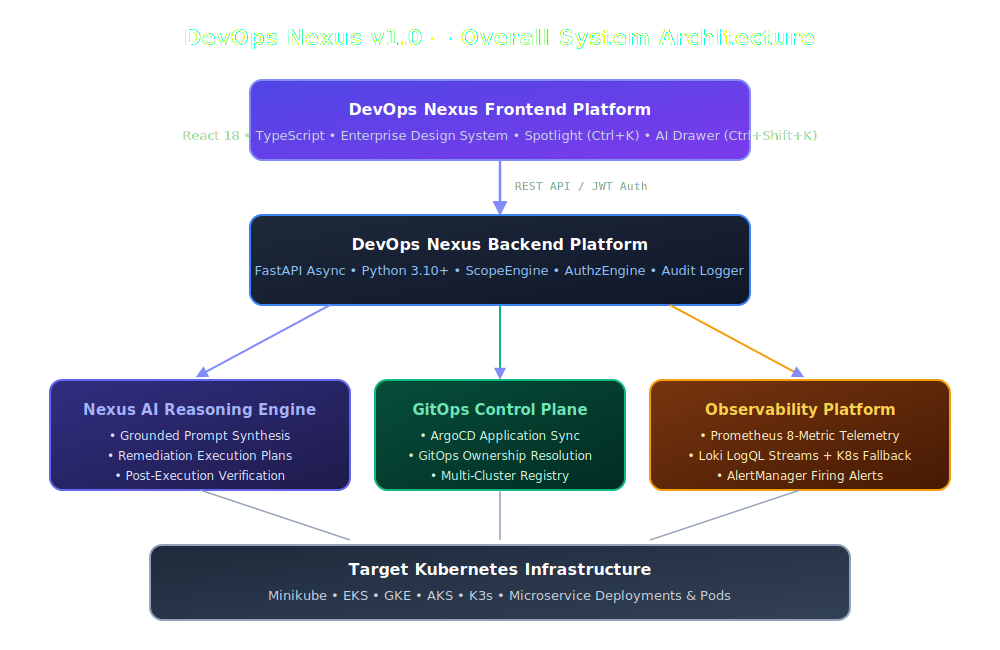
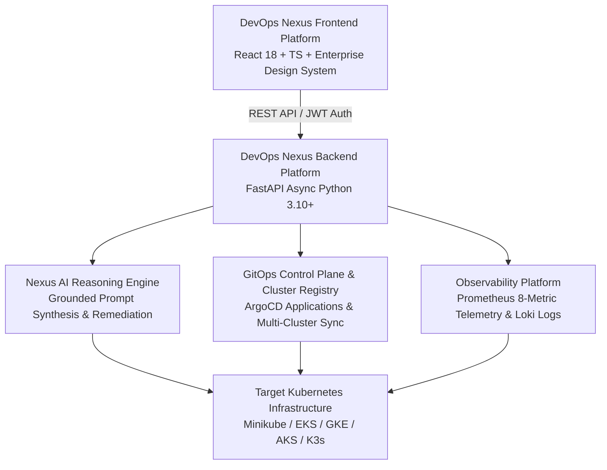
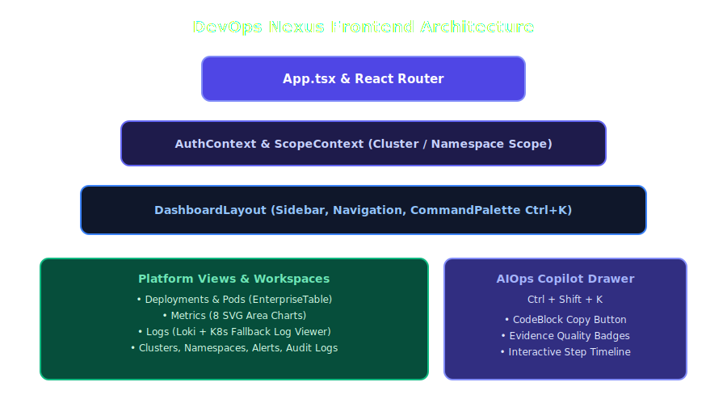
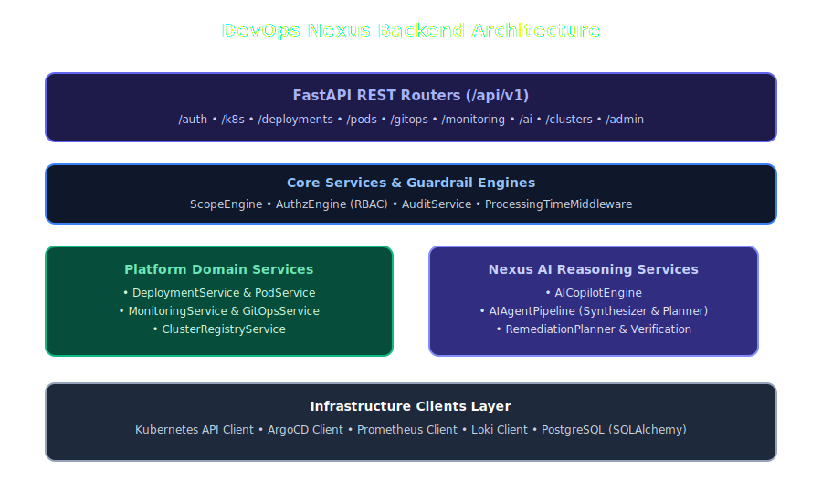
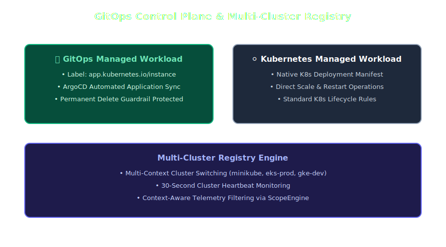
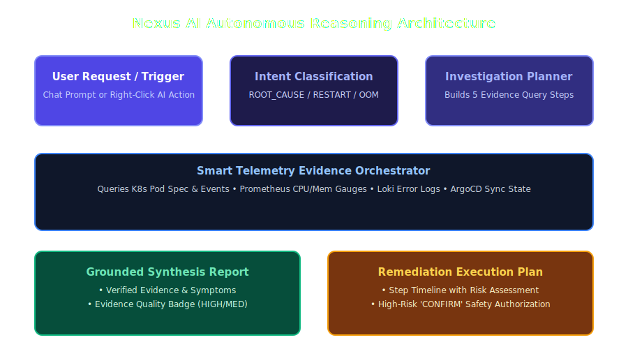
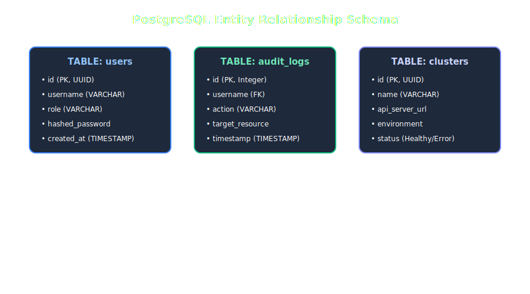

# 🏗️ DevOps Nexus v1.0 — System Architecture

**DevOps Nexus v1.0** is an enterprise-grade platform uniting **Kubernetes Workload Management**, **ArgoCD GitOps Control Plane**, **Nexus AI Autonomous Incident Investigation**, **Grafana/Prometheus Telemetry**, and **Loki Log Analytics**.

---

## 🏛️ Overall Architectural Blueprint

---

## 🧩 Subsystem Architecture Overview

### 1. Frontend Platform Layer (React 18 + TypeScript + Vite)

- **Enterprise Design System**: Standardized CSS custom variables (`design-system.css`) and design tokens (`designTokens.ts`).
- **Spotlight Command Palette (`Ctrl + K`)**: Global search across resources, pages, and AI actions.
- **Autonomous AIOps Copilot Drawer (`Ctrl + Shift + K`)**: Grounded incident investigation with code copy and step timelines.

---

### 2. Backend Platform Layer (FastAPI Async)

- **Asynchronous Architecture**: High-concurrency endpoints using Python `asyncio` and `httpx`.
- **JWT Security & RBAC Guardrails**: Role-based access control checking user roles (`Administrator`, `Platform Engineer`, `DevOps Engineer`, `Viewer`).

---

### 3. GitOps Control Plane & Multi-Cluster Registry

- **GitOps Ownership Resolution**: Automatic detection of ArgoCD application management vs native K8s workloads.
- **Multi-Cluster Registry**: Multi-context cluster registration with heartbeat monitoring.

---

### 4. Nexus AI Autonomous Investigation Engine

- **Prompt Synthesis Engine**: Grounded incident investigation combining K8s pod state, Prometheus metric spikes, and Loki error logs.
- **Remediation Plan Generator**: Interactive multi-step execution plans with safety confirmation guardrails.

---

### 5. PostgreSQL Database Schema

---

## 🔗 Related Documentation
- 📋 [01-prerequisites.md](01-prerequisites.md) — System prerequisites
- 🔀 [04-ci-cd-gitops.md](04-ci-cd-gitops.md) — GitOps pipelines
- 🧠 [07-nexus-ai.md](07-nexus-ai.md) — Nexus AI architecture
- 🔌 [11-api-reference.md](11-api-reference.md) — Backend API specification
