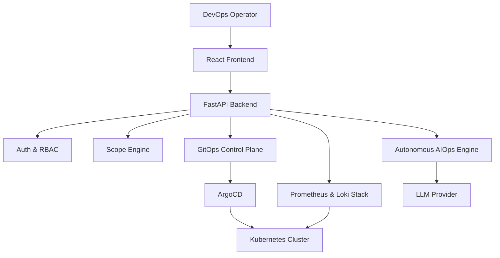

# System Architecture & Component Interaction Guide

## Platform Overview

DevOps Nexus is structured as an Enterprise Internal Developer Platform (IDP). It isolates infrastructure complexities behind a unified REST API and TypeScript web dashboard.

---

## 🏗️ Architecture Pipeline

---

## 🧩 Component Responsibilities

1. **Frontend (`platform/frontend`)**:
   * Built with Vite, React 18, and TypeScript.
   * Renders real-time telemetry graphs, deployment cards, pods inventory, GitOps status modals, and AIOps Assistant interface.

2. **Backend Service (`platform/backend`)**:
   * Built with FastAPI and Python 3.13.
   * Provides REST APIs for authentication, Kubernetes resources, ArgoCD control plane, Prometheus metrics, Loki log streams, and AI investigations.

3. **Unified Scope Engine (`scope_engine.py`)**:
   * Resolves target environment parameters (`CLUSTER`, `NAMESPACE`, `APPLICATION`, `DOMAIN`) to scope queries dynamically.

4. **Autonomous Investigation Engine (`ai_agent_pipeline.py`)**:
   * Executes multi-phase SRE investigations using `InvestigationPlanner`, `ToolScheduler`, `MissingEvidenceDetector`, `CorrelationEngine`, `ConfidenceEngine`, and `ReasoningEngine`.
