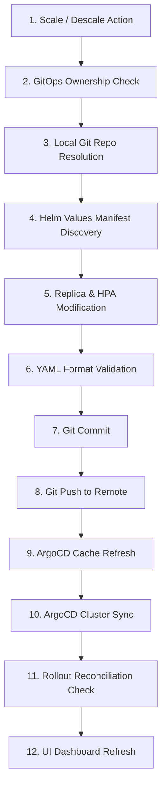

# GitOps Control Plane & Continuous Delivery Guide

## Overview

DevOps Nexus implements an Enterprise GitOps Control Plane. Infrastructure changes (such as scaling replica counts or modifying configurations) are written to Git repositories and reconciled declaratively via ArgoCD.

---

## 🔄 12-Stage GitOps Write-Back Pipeline

---

## 🛠️ Key Operations

### Scaling Workloads
1. Navigate to **Deployments** page on the dashboard.
2. Click **Scale** on a GitOps-managed deployment (e.g. `auth-service`).
3. Select target replica count and confirm.
4. The platform executes the 12-stage write-back pipeline, updating `helm/auth/values-prod.yaml`, committing to Git, pushing to GitHub origin, and triggering ArgoCD synchronization.
