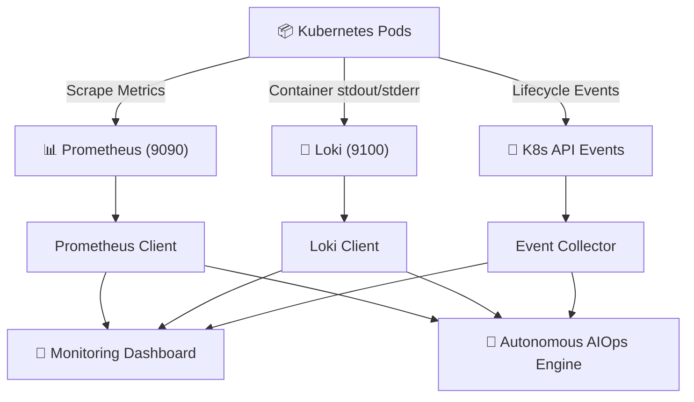

# Observability & Telemetry Integration Guide

## Overview

The observability stack in DevOps Nexus aggregates metrics, container log streams, and Kubernetes cluster events into real-time visual dashboards and AI diagnostic context.

---

## 📊 Telemetry Data Flow

---

## 🛡️ Zero-Degraded Fail-Safe Guarantee

1. **Continuous Port Supervisor Daemon**: Checks ports 9090 (Prometheus), 3100 (Loki), and 8082 (Grafana) every 3 seconds and auto-heals dropped port-forwards.
2. **K8s API Metric Synthesis**: If Prometheus is offline, `prometheus_client` synthesizes metrics vector/matrix JSON directly from live Kubernetes pod and node states.
3. **K8s Log Stream Synthesis**: If Loki is offline, `loki_client` queries live container logs via `read_namespaced_pod_log` and returns valid stream structures.
