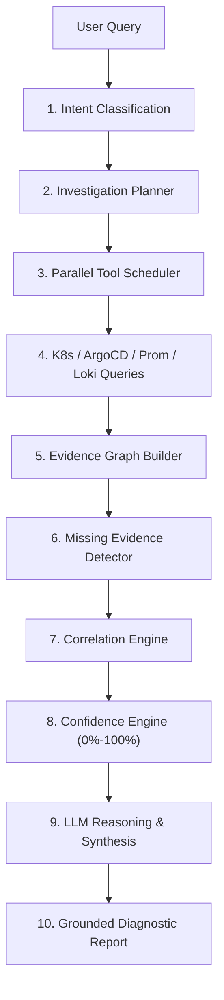

# Autonomous AIOps Assistant Guide

## Overview

The **AIOps Assistant** in DevOps Nexus is an autonomous SRE investigation engine. It goes beyond simple chatbot prompting by formulating diagnostic plans, executing parallel telemetry queries, detecting missing evidence, correlating cross-domain signals, and calculating deterministic confidence scores.

---

## 🧠 SRE Investigation Workflow

---

## 🔑 Key Diagnostic Concepts

* **Tool-First Execution**: The AI executes tool queries against live cluster infrastructure before formulating diagnostic explanations.
* **Evidence Correlation**: Automatically correlates container exit codes (`Exit 137` OOMKilled), image pull errors, deployment sync drifts, and node memory pressure.
* **Confidence Scoring**: Computes mathematical confidence scores based on evidence completeness, tool success rates, and correlation strength.
* **Zero-Hallucination Assurance**: Every reported fact or metric must cite a specific line in the Evidence Graph.
